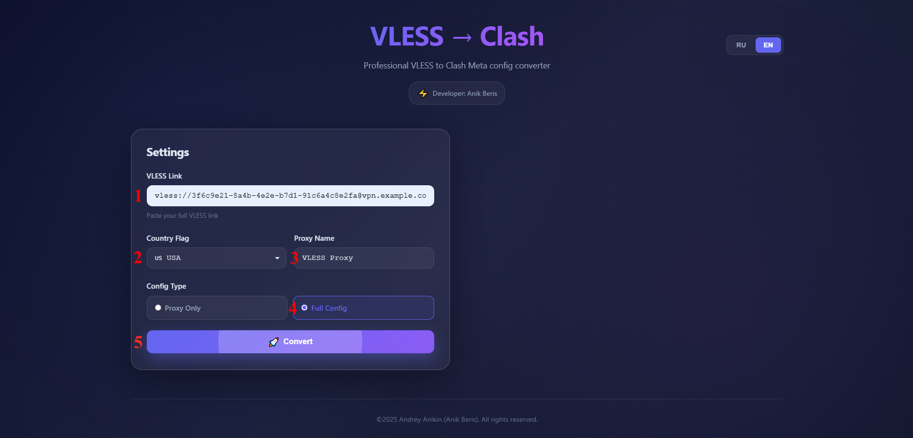
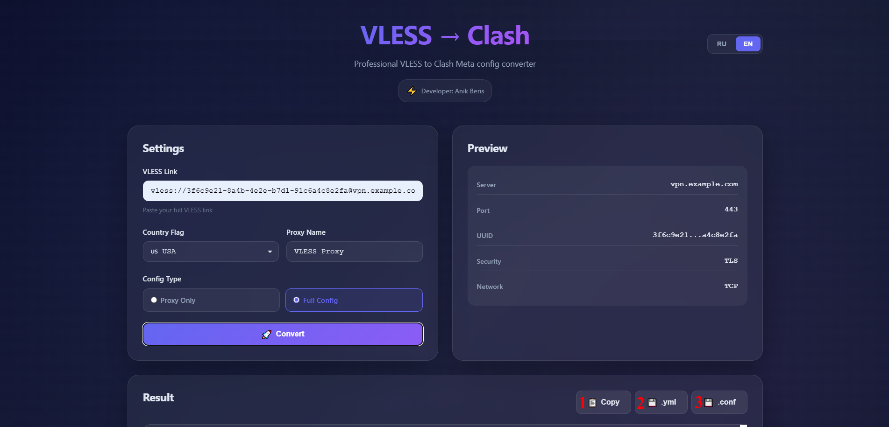

  <picture>
    <source media="(prefers-color-scheme: dark)" srcset="./media/logo-dark.png">
    
  </picture>

---

  

<h1 align="center"> 
vless-config-converter - это конвертер ссылок Vless в готовый конфиг фаил <code>.yml</code> <code>.conf</code>
</h1>

<h2 align="center">
> 💡 Данный ресурс создан в учебных и ознакомиткльных целях.
</h2>

* * * * * * * * * * * * * * * * * * 
* * * * * * * * * * * * * * * * * * 

<h2 align="center">
⚠️ Отказ от ответственности ⚠️
</h2>

  Автор не несёт ответственности за любые возможные последствия использования данного проекта.
   
  Данный ресурс создан в ознакомиткльных целях
   
  Материалы предназначен для защиты данных.
   
  Используйте на свой страх и риск.

 
    
⚠️полный текст⚠️

    
Используйте на свой страх и риск.

1. Используя материалы репозитория, вы автоматически соглашаетесь с условиями лицензионного соглашения, связанными с ним.

2. Автор не предоставляет никаких гарантий, явных или подразумеваемых, относительно точности, полноты или пригодности материалов репозитория для каких-либо конкретных целей. 
   
3. Автор не несёт ответственности за любые убытки, включая, помимо прочего, прямые, косвенные, сопутствующие, косвенные или специальные убытки, возникшие из-за использования или невозможности использования этого образа или сопровождающей его документации, даже если о возможности таких убытков было заранее сообщено.

4. Используя материалы репозитория, вы подтверждаете и принимаете на себя все риски, связанные с его применением. Кроме того, вы соглашаетесь, что автор не может быть привлечён к ответственности за какие-либо проблемы или последствия, возникшие в результате его использования.

 

---

<h3 align="center"> 
💖 Поддержите проект 
</h3>

 
Если этот проект оказался полезным для Вас, вы можете оценить его, поставив звёздочку.:star2: 

<h4 align="center"> 
Пожертвования горячо приветствуются, какими бы маленькими они ни были, и большое спасибо. 😌 
</h1>

|  |  |
|-------------:|:-------------|
| **Tether USDT (BEP20)** |`0x22258ea591966e830199d27dea7c542f31ed5dc5`|
| **Bitcoin (BTC)** |`1Dbwq9EP8YpF3SrLgag2EQwGASMSGLADbh`|
| **Ethereum (ERC20)** | `0x22258ea591966e830199d27dea7c542f31ed5dc5`|
| **Binance Smart Chain (BEP20)** | `0x22258ea591966e830199d27dea7c542f31ed5dc5`|
| **Solana (SOL)** | `yYYXsiVTzsvfvsMnBxfxSZEWTGytjAViE2ojf3hbLeF`|

---

   Спасибо за Ваше внимание к проекту и за поддержку 💙 

---

* * * * * * * * * * * * * * * * * * 
* * * * * * * * * * * * * * * * * * 

<h1 align="center">
⚠️ Отказ от ответственности ⚠️
</h2>

 
    
 ⚙️ Развернуть описание 

Используйте на свой страх и риск.

1. Используя материалы репозитория, вы автоматически соглашаетесь с условиями лицензионного соглашения, связанными с ним.

2. Автор не предоставляет никаких гарантий, явных или подразумеваемых, относительно точности, полноты или пригодности материалов репозитория для каких-либо конкретных целей. 
   
3. Автор не несёт ответственности за любые убытки, включая, помимо прочего, прямые, косвенные, сопутствующие, косвенные или специальные убытки, возникшие из-за использования или невозможности использования этого образа или сопровождающей его документации, даже если о возможности таких убытков было заранее сообщено.

4. Используя материалы репозитория, вы подтверждаете и принимаете на себя все риски, связанные с его применением. Кроме того, вы соглашаетесь, что автор не может быть привлечён к ответственности за какие-либо проблемы или последствия, возникшие в результате его использования.

 

  

<h1 align="center">Подготовка к использованию</h1>

<h2 align="center"> Откройте сайт
  <a href="https://anikberis.github.io/vless-config-converter/"target="_blank"> vless-config-converter </a>
</h2>

<h2>Вкладка <code>Settings</code></h2>

<ol style="font-size: 18px;">
  <li>
    В поле <code>VLESS Link</code> вставьте вашу VLESS-ссылку.
     
    <strong>Пример:</strong>
    <code>
      vless://UUID@vpn.example.com:443?type=tcp&security=reality&pbk=...&fp=chrome&sni=www.cloudflare.com#My_VLESS_Node
    </code>
  </li>

  <li>
    В поле <code>Country Flag</code> выберите флаг страны, в которой расположен сервер
  </li>

  <li>
    В поле <code>Proxy Name</code> укажите имя прокси, которое будет использоваться в конфигурационном файле
  </li>

  <li>
    В разделе <code>Config Type</code> выберите <code>Full Config</code>
  </li>

  <li>
    Нажмите кнопку <code>Convert</code> для генерации конфигурации
  </li>
</ol>

  

---

<h1 align="center">Скачивание конфигурационного файла</h1>
<h2>Вкладка <code>Result</code></h2>
<ol style="font-size: 18px;">
  <li>
    кнопка <code>Copy</code> - скопировать конфигурацию в буфер обмена
  </li>
  <li>
    кнопка <code>.yml</code> - скачать конфигурацию в формате <code>.yml</code>
  </li>
  <li>
    кнопка <code>.conf</code> - скачать конфигурацию в формате <code>.conf</code>
  </li>
</ol>

  

